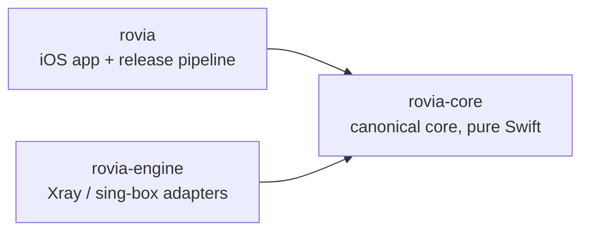

# Rovia

**An open-source, privacy-first network client for Apple platforms — 
built so that a routing decision can be _shown_, not just applied.**

  

  

[**rovia**](https://github.com/RoviaNetwork/rovia) · [**rovia-core**](https://github.com/RoviaNetwork/rovia-core) · [**rovia-engine**](https://github.com/RoviaNetwork/rovia-engine)

---

> [!IMPORTANT]
> **Honest status, October 2026.** Rovia is pre-alpha. Subscription import,
> strict configuration and explainable routing work and are tested — the tunnel
> engine is not wired in yet, so **no build today establishes a VPN tunnel**, and
> no VPN claim is made anywhere in the organization. Every repository states
> exactly where that line is.

## The app today

| Overview — iPhone | Overview — iPad | Subscriptions — iPhone |
| :---: | :---: | :---: |
|  |  |  |

Real screenshots of the current build, running on built-in sample data. The disabled **Connect** button is the
clearest single statement of where the project is: nothing in the UI pretends a tunnel exists.

## What works and what does not

| | |
| --- | --- |
| ✅ **Works, and tested** | Subscription import (URL, clipboard, `rovia://` deep links) for `vless://`, `trojan://` and `ss://` SIP002; strict canonical configuration; explainable routing with redacted diagnostics; deterministic, health-aware server selection; Keychain secrets; file store with last-good rollback; Xray config compilation with secret placeholders. |
| 🔧 **Stubbed** | The tunnel runtime: `TunnelEngine.prepare`/`start` are typed stubs. No libXray artifact is built or bundled. |
| ❌ **Does not exist yet** | A working tunnel on a device, a signed build, a macOS client, an Android client. |

## Repositories

| Repository | What lives there | CI |
| --- | --- | :---: |
| [**rovia**](https://github.com/RoviaNetwork/rovia) | The iOS app (SwiftUI), Apple platform integration and the release pipeline. Consumes `rovia-core` as a pinned SPM dependency — exact version, never a checkout. |  |
| [**rovia-core**](https://github.com/RoviaNetwork/rovia-core) | The canonical core: config models, subscription parsing/fetch/import/store, routing evaluation, engine contracts. No UI, no network in tests. |  |
| [**rovia-engine**](https://github.com/RoviaNetwork/rovia-engine) | Engine integration: Xray/sing-box adapters, canonical-to-engine config compilation, artifact builds. Production choice: **Xray via libXray** (MPL-2.0; sing-box is GPL-3.0 and disabled). |  |

Dependency direction: `rovia` → `rovia-core` ← `rovia-engine`. A DAG, no cycles —
an engine never touches the canonical model or the UI.

## Privacy, as a design constraint

- **No telemetry, no analytics, no advertising SDK.** `telemetryEnabled` exists only as a schema constant pinned to `false` — and the validator *rejects* a document that sets it.
- **No browsing-history logging.** Raw routing traces are deliberately not `Codable`, so they cannot leak into a diagnostic, a log line, or a file.
- **Secret references, not credentials.** Persisted configuration holds a `SecretReference`; the value never reaches a model, a diagnostic, or an error message.
- **Public Apple APIs only.** `NEPacketTunnelProvider` — no raw `utun`, no private API, no post-install downloads.

The authoritative statement lives in [`PRIVACY.md`](https://github.com/RoviaNetwork/rovia/blob/main/PRIVACY.md).

## Roadmap

1. ✅ **Canonical core** — config, subscription, routing, selection: implemented, tested, engine-free.
2. 🔜 **Engine integration** — a pinned Xray commit, a reproducible build recipe, an artifact digest, conformance tests.
3. **Packet tunnel** — the `packetFlow` ⇄ engine bridge, dual-stack, lifecycle under loss.
4. **Device validation** — real profiles, real traffic, reconnect and failover evidence.
5. **Signed distribution** — an Apple Developer team, archive, export, TestFlight.
6. **Beta** — a real provider configuration, and an App Store privacy label that matches what the code does.

## Get involved

- **Contribute** — read [`CONTRIBUTING.md`](https://github.com/RoviaNetwork/rovia/blob/main/CONTRIBUTING.md) first; open an issue or an RFC before a substantial change.
- **Report a vulnerability** — privately, via [`SECURITY.md`](https://github.com/RoviaNetwork/rovia/blob/main/SECURITY.md), never a public issue.
- **Follow along** — watch [**rovia**](https://github.com/RoviaNetwork/rovia) for when there is something to release.

---

Pre-alpha software. No tunnel, no release, no App Store presence — built to be audited.

